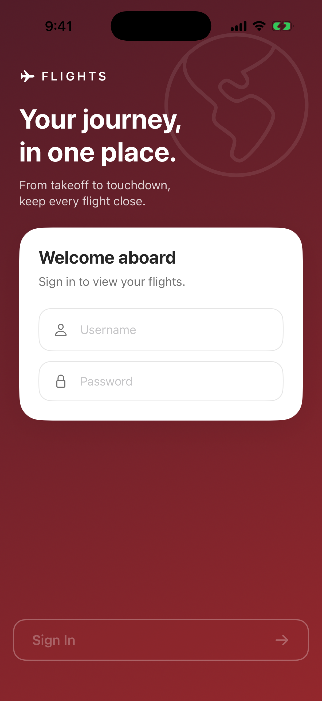
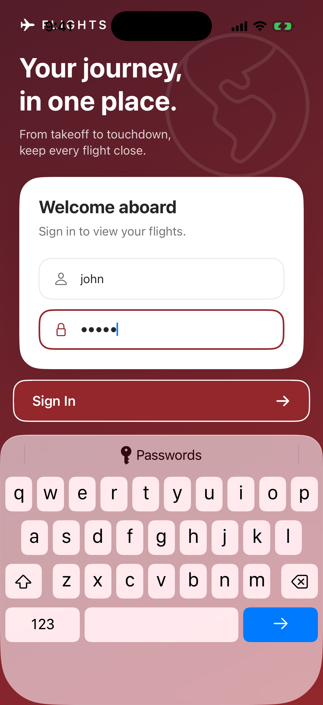
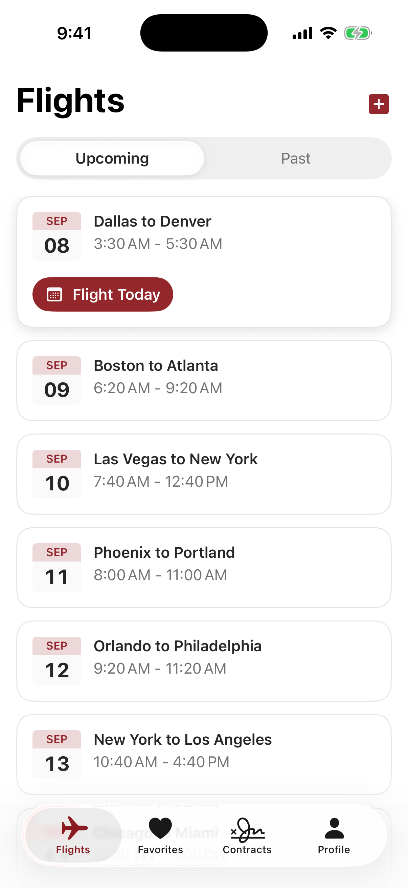
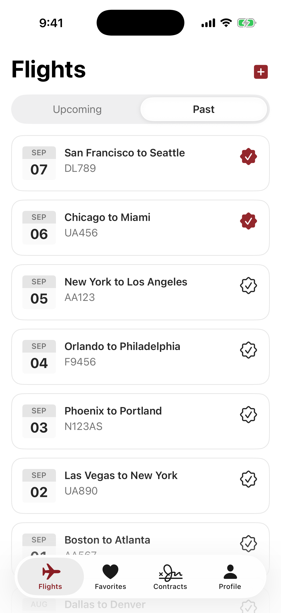
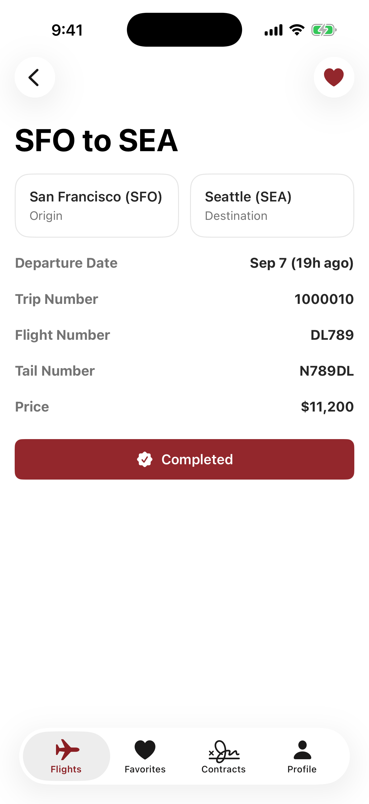
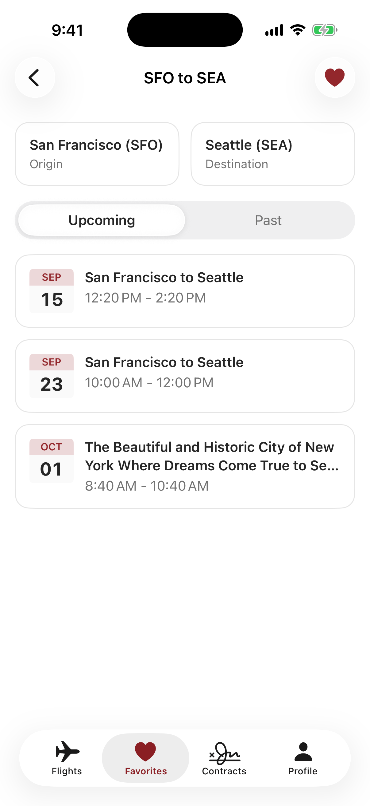
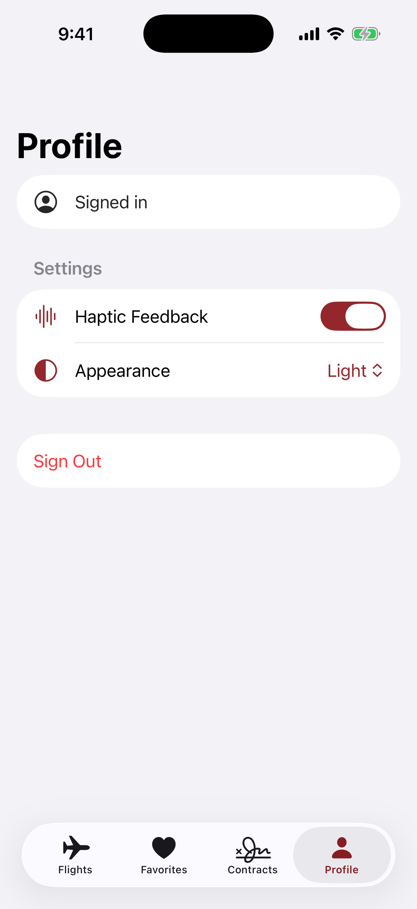
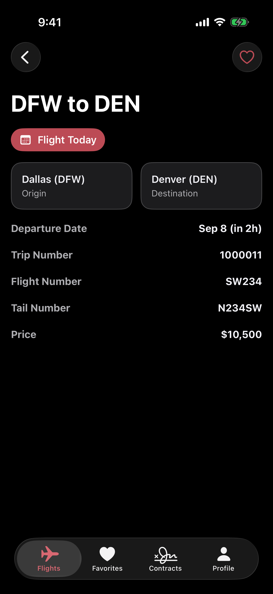

<h1>&nbsp; Flights</h1>

An iOS take-home for Flexjet: sign in, browse Upcoming/Past flights in your time zone, and mark
past flights complete. Includes favorite routes, persistent sessions, retry/refresh states, haptics,
and appearance settings.

## Architecture

SwiftUI + Swift 6 + Observation, using MVVM with a typed navigation router and injected dependencies.
A URLSession client sits behind a protocol; DTO validation, business rules, and formatting stay
outside views. Tokens use Keychain; completion, favorite routes and preferences are device-local.
Flight lists share a session-scoped cache. Analytics uses an injectable provider with local logging.
No third-party app dependencies. [Architecture and ADRs](docs/architecture.md) · [Analytics](docs/analytics.md)

## Get started

Requires Xcode with the iOS 26.2+ SDK and simulator runtime, plus SwiftLint (`brew install swiftlint`).
Open `Flights/Flights.xcodeproj`, select **Flights**, and run. Demo login: **`john` / `12345`**.

Run tests in Xcode with **Cmd-U**, or set up the CLI tools with rbenv installed:

```sh
rbenv install -s
gem install bundler -v 2.6.9
bundle config set --local path vendor/bundle
bundle install
bundle exec fastlane test
bundle exec fastlane coverage  # full suite; requires 95% coverage in each business layer
swiftlint
```

Ruby and gem versions are recorded in `.ruby-version` and `Gemfile.lock`. The test lane defaults
to an iPhone 17 Pro simulator. Lint violations and compiler warnings fail the build.
[More commands](docs/development.md) · [Coverage requirements and results](docs/testing.md)

## Scope notes

Contracts and Add Flight are placeholders. Completion and favorites are local-only; analytics has
no remote provider yet. Date-based screens refresh for clock/time-zone changes and departure/day
boundaries. There is no UI test target, and Proxima Nova assets are pending.
[UI notes and limitations](docs/ui-notes.md) · [Service behavior](docs/service-and-behavior.md)

## Time breakdown

| Area | Recorded time |
| --- | --- |
| First pass (Login + Flights; not tracked separately) | 0.5 hours |
| Nice-to-haves (tests, previews, states, accessibility) | ~2 hours |
| Additional (project setup, lint config, README) | 1.5 hours |


[Full documentation and decision index](docs/README.md)

## Screenshots

Captured on the iPhone 17 Pro simulator. Select a screenshot to view it at full size.

<table>
  <tr>
    <th align="center">Sign in</th>
    <th align="center">Keyboard support</th>
    <th align="center">Upcoming flights</th>
    <th align="center">Past flights</th>
  </tr>
  <tr>
    <td><a href="screenshots/login.png"></a></td>
    <td><a href="screenshots/login-keyboard.png"></a></td>
    <td><a href="screenshots/upcoming-flights.png"></a></td>
    <td><a href="screenshots/past-flights.png"></a></td>
  </tr>
  <tr>
    <th align="center">Completed flight</th>
    <th align="center">Favorite route</th>
    <th align="center">Profile settings</th>
    <th align="center">Dark appearance</th>
  </tr>
  <tr>
    <td><a href="screenshots/completed-flight.png"></a></td>
    <td><a href="screenshots/favorite-route.png"></a></td>
    <td><a href="screenshots/profile-settings.png"></a></td>
    <td><a href="screenshots/flight-details-dark.png"></a></td>
  </tr>
</table>
